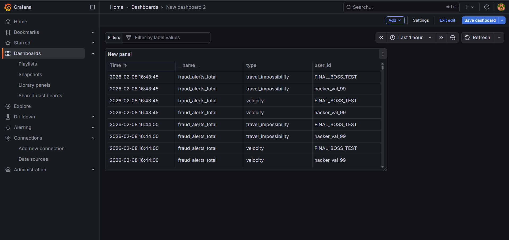
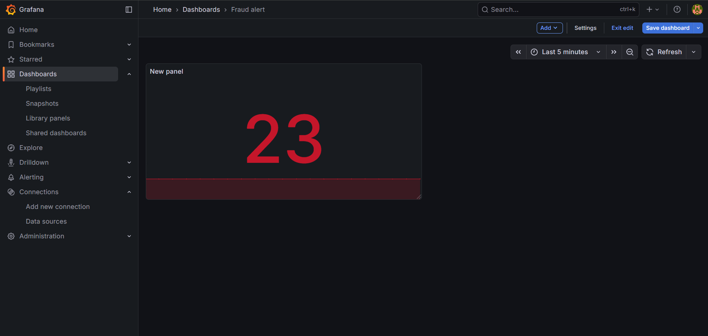
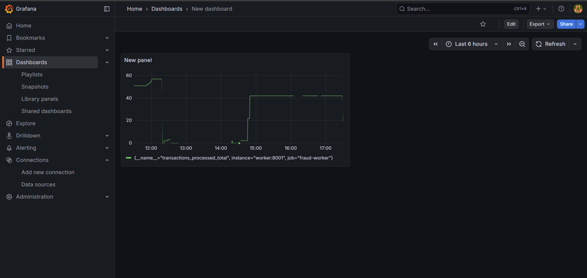

# 🕵️ Real-Time Fraud Detection & Monitoring Pipeline

A high-throughput, distributed event-driven system designed to ingest, process, and visualize financial fraud in real-time. This pipeline leverages a modern tech stack to detect "Bad Actors" using geographic impossibility, spending spikes, and high-velocity transaction rules.

## 🚀 System Architecture
- **API Ingestion**: **FastAPI** (Asynchronous) handles high-concurrency transaction intake.
- **Message Broker**: **Apache Kafka** ensures reliable, distributed message streaming.
- **Stream Processing**: **Python Worker** nodes consume Kafka topics and apply fraud detection logic.
- **State Store**: **Redis** provides sub-millisecond lookups for geographic tracking and user velocity.
- **Observability**: **Prometheus** scrapes real-time metrics, visualized through **Grafana**.

## 📊 Live Monitoring Dashboard
The system provides a real-time "Wall of Shame" for fraudulent users.

### 1. Security Audit Log
Identifies specific `user_id`s (like `hacker_val_99`) and the specific fraud type detected.


### 2. Detection Volume
A high-visibility "Stat Panel" showing total detected incidents in the current window.


### 3. System Throughput
Monitors the "heartbeat" of processed events to ensure worker stability.


## 🛠️ Setup & Deployment
### Prerequisites
- Docker & Docker Compose
- Python 3.11+

### Installation
1. **Launch the Infrastructure**:
   ```bash
   docker compose up -d --build

2. **Install Stress Test dependencies**:
   ```bash
   pip install requests

3. **Run Traffic Simulation**:
   ```bash
   python scripts/stress_test.py